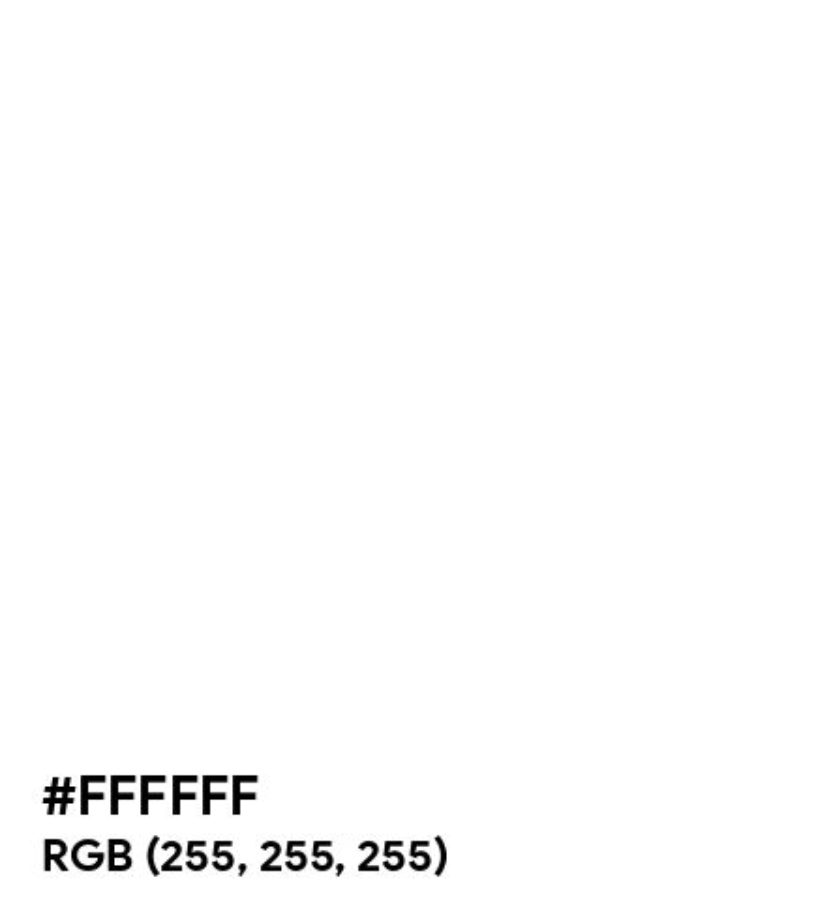

[View deployed site here](https://odmarken.github.io/BeFast/)

# Be Fast Reflex Game

## Overview
Welcome to Be Fast! This engaging and fast-paced game is meticulously designed to test and improve your reaction speeds in a fun and challenging way. As you play, uniformly sized boxes will randomly appear on different parts of the screen. Your task is simple yet challenging: click on these boxes as quickly as possible before they disappear. Each box can appear at any moment, with intervals varying randomly between 0 to 6000 milliseconds. This setup continuously challenges your reflexes without the complexity of levels or scoring. Dive into Be Fast and challenge yourself to maintain precision and speed over a prolonged period. Perfect for players of all ages seeking to sharpen their sensory skills and reaction times in an exciting, interactive format.

## Features
- **Dynamic Difficulty:** The game is fast paced, with boxes appearing more rapidly.
- **Score Tracking:** Your reaction times are recorded, allowing you to track your improvement.
- **User-Friendly Interface:** A clean and intuitive interface ensures you can focus on the game without distractions.

## How to Play
1. **Start the Game:** The game start automatically.
2. **Click the Boxes:** Boxes will appear at random positions on the screen. Click them as quickly as you can.
3. **Keep an Eye on the Timer:** The game records your reaction time for each box.

## User Experience (UX) 

### Visitor goals

| **User stories**                                                                                          |
|-----------------------------------------------------------------------------------------------------------|
| As a user, I want to easily understand the main purpose of the site                                       |
| As a user, I want to have a better how the game works                                                     |
| As a user, I want to get a better understanding how to complete the challange                             |
|-----------------------------------------------------------------------------------------------------------|

## Features

1.	**Title**  
    
    The title stays clean and understandable so the user can instantly see what it means and recognize it.

    

2.	**Heading/Rules**  

     The heading provides a simple statement and shows you how to react, while the Rules section offers a straightforward rule to follow and explains how to play the game.
   
    
    

3.	**Game**  
    
    The game is a reaction-type game that will challenge you to the edges, perfect for reflex practice or for gamers who want to improve their aim in FPS shooting games.

    

## Design

### Colours

The color design I have been using is black, white, and red, with a graphic background to make it more 'game-like'. I have added a shadow to the playground to sometimes make the game boxes hard to see, increasing the challenge.

### Typography

In this project Ive used ('https://fonts.googleapis.com/css2?family=Pridi:wght@200;300;400;500;600;700&display=swap') 
from google font [View deployed site here](https://fonts.google.com/)

## Technologies and tools used

- [HTML5](https://en.wikipedia.org/wiki/HTML5)
- [CSS3](https://en.wikipedia.org/wiki/CSS)
- [JavaScript](https://it.wikipedia.org/wiki/JavaScript)
- Version control: [Git](https://git-scm.com/)
- Public repository: [GitHub](https://github.com/)
- [Google Fonts:](https://fonts.google.com/) font used is "Pridi".
- [Font Awesome:](https://fontawesome.com/) is used on header and form sign up and also footer.
- Lighthouse: [Lighthouse](https://developer.chrome.com/docs/lighthouse/overview/)
- Free Images: [Pexels](https://www.pexels.com/search/website%20background/)

### HTML validation

### CSS validation

### JS validation 

### Lighthouse testing

### Browser compatibility

- Google Chrome
- Safari
- Firefox
- Opera GX
- Microsoft Edge

## Testing

1. [HTML validation](#html-validation)
2. [CSS validation](#css-validation)
3. [JavaScript validation](#js-validation)
4. [Lighthouse testing](#lighthouse-testing)
5. [Browsers compatibility](#browser-compatibility)

## Deployment

I've deployed the website on GitHub Pages.

To deploy the website:

1. from the GitHub repository, click on 'settings'
2. find and click on 'pages' on the setting sidebar menu
3. select the branch to be used. In this case 'main'
4. Refresh the page and in a few minutes, the following message will appear if the website was deployed correctly

